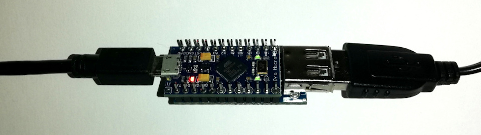
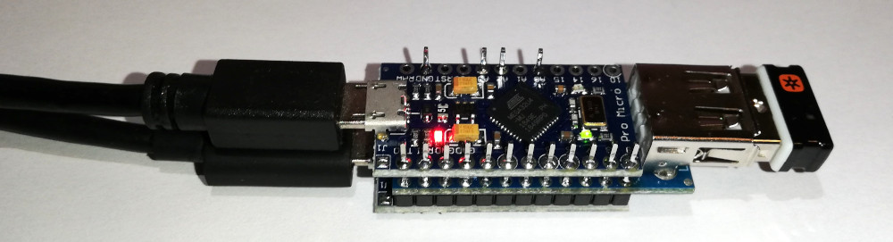

# HID Keyboard and Mouse wrapper for the Vampire 4

The Vampire 4, in its current state, only supports a limited amount of USB Mice and Keyboards. This is a workaround to make more of them work with the V4. Also for already working devices that need to be unplugged and plugged in again in order to get recognized the adapter removes this requirement.

It uses combination of one or two "Pro Micro" (3.3V / 8 MHz version) Arduino clones, and a "Mini USB Host Shield 2.0" board as an adapter in between the keyboard/mouse and the V4.

The one device version can act as an adapter for either a mouse or a keyboard (which can be selected via a jumper).

The two device version can act as an adapter for composite mouse+keyboard devices (for example wireless mouse+keyboard combos that only use one USB receiver dongle).

Build instructions to build the one device adapter can be found at:
- http://okiraku-camera.tokyo/blog/?p=8193 (japanese)
- https://geekhack.org/index.php?topic=80421.0

Build instructions to build the two device version:
[two_device_build.md](two_device_build.md)

To build the software for the adapter the following is needed:
- Use Arduino IDE v1.6.5-r5 (needed for the changes below - the last version before a refactoring of the USB stack)
- Install the "USB Host Shield Library 2.0"
- Apply the changes from https://github.com/tkoecker/Arduino/commit/e6783cb5e4b7e1dc8abc4932b3e3543ad793c6ff
  and https://github.com/tkoecker/Arduino/commit/790e3472ea00df73c100a9cd8d93a1ec98198a04 to
  get an USB core that uses low-speed USB, with only one boot protocol HID keyboard or mouse.

On the one device version the adapter software is in mouse mode by default. If a jumper is put between pin 2 and GND the adapter is in keyboard mode.

TODO:
- Check if mice/keyboards connected via USB hubs can be supported (which would make it possible to share the same mouse and keyboard on different hosts via an USB switch).
- Create a 3D printed case.
