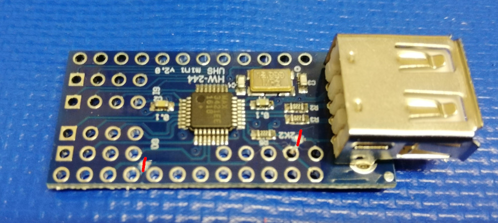

# Build instructions for the two device version of the adapter

- Solder two pin headers (with long pins) on one of the "Pro Micro" boards:

- Cut the VBus and Reset traces on the "Mini USB Host Shield 2.0" as shown:

- Solder in wires for the rerouted VBus and Reset lines:

- Stack the "Mini USB Host Shield 2.0" onto the "Pro Micro", and solder the pins.
- Solder the VBus wire to the RAW pin of the "Pro Micro", and the reset wire to the reset pin of the "Pro Micro".
- Solder connections between the pins labeled GND, A1, and A2 on the "Pro Micro".
- Cut the pins labeled RAW, RST, A1, 14, 15, 16, and 10 on the "Pro Micro" (i.e. those should only connect the first "Pro Micro" and the "Mini USB Host Shield 2.0", but not the 2nd "Pro Micro").

- Stack the 2nd "Pro Micro" onto the "Mini USB Host Shield 2.0", and solder the remaining pins.

- Flash the software on both "Pro Micro"s.

The bottom "Pro Micro" will act as an USB mouse.
The top "Pro Micro" will act as an USB keyboard.

***DISCLAIMER:***

This hardware/software is provided "as is", and you use the hardware/software at your own risk. Under no circumstances shall any author be liable for direct, indirect, special, incidental, or consequential damages resulting from the use, misuse, or inability to use this hardware/software, even if the authors have been advised of the possibility of such damages.
